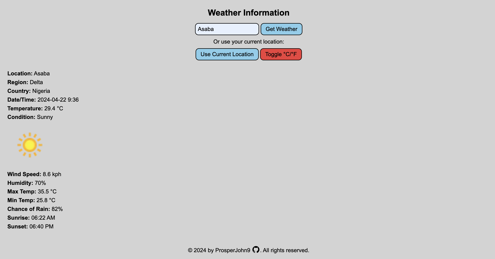

# Weather App

Live demo:
https://prosperjohn9.github.io/weather-app/dist/

Desktop View:

Mobile View:

## Description

This project was created for the [Weather App](https://www.theodinproject.com/lessons/node-path-javascript-weather-app) assignment as part of The Odin Project curriculum. I met all the assignment objectives and then expanded on it with my own concepts to make it more functional and user-friendly.

## Features

- Display current weather conditions
- Show temperature, humidity, and wind speed
- Search for weather information by location
- Responsive design for mobile and desktop

## Technologies Used

- HTML
- CSS
- JavaScript

## Objectives

1. Access OpenWeather API
2. Process JSON Result
3. Allow User to Enter Location
4. Add "Loading" Component
5. User Location via the Geolocation API

## License

This project is licensed under the [MIT License](LICENSE).

## Contributing

Contributions are welcome! Please fork this repository and submit a pull request.

## Contact

For any questions or suggestions, please feel free to reach out to me at prosperjohn9@gmail.com
