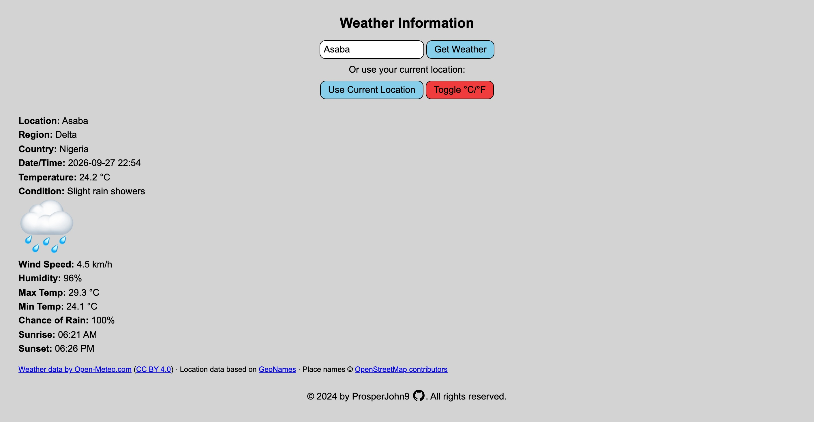
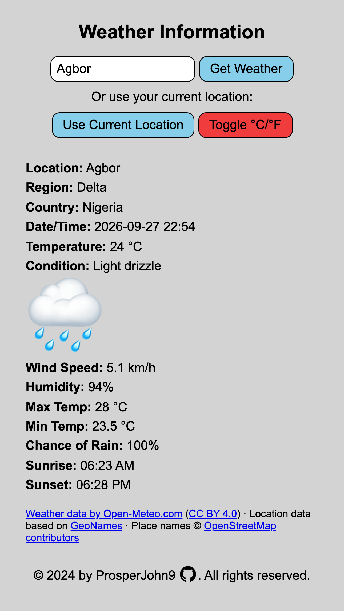

# Weather App

Live demo:
https://prosperjohn9.github.io/weather-app/dist/

Desktop View:



Mobile View:



## Description

This project was created for the [Weather App](https://www.theodinproject.com/lessons/node-path-javascript-weather-app) assignment as part of The Odin Project curriculum. I met all the assignment objectives and then expanded on it with my own concepts to make it more functional and user-friendly.

## Features

- Display current weather conditions, with a description and an icon
- Show temperature (toggle between °C and °F), humidity, and wind speed
- Show today's high and low, chance of rain, sunrise, and sunset
- Search for weather information by place name, or by coordinates such as `6.25, 6.19`
- Use your current location, with the name of the place you are in
- Loading indicator while data is fetched
- Responsive design for mobile and desktop

## No API Key Needed

The app uses free services that need no API key:

- [Open-Meteo](https://open-meteo.com/) for the weather, and its geocoding API for place search
- OpenStreetMap's [Nominatim](https://nominatim.org/) for the place name when you use your current location

Your position is rounded to about 110 m before it is sent, and place names are looked up once per visit, as the [Nominatim usage policy](https://operations.osmfoundation.org/policies/nominatim/) asks.

## What Changed (September 2026)

The first version used WeatherAPI. The app now uses Open-Meteo and Nominatim, which are free and need no API key.

At the same time:

- Weather data is shown with `textContent` instead of `innerHTML`, so text from an API is never run as HTML.
- A failed search no longer leaves "Loading..." on the screen.
- Weather codes are mapped to text and icons in `src/weatherCodes.mjs`, with tests.

## Data Sources and Credits

- Weather data by [Open-Meteo.com](https://open-meteo.com/), licensed under [CC BY 4.0](https://creativecommons.org/licenses/by/4.0/). Temperatures in °F are converted from Open-Meteo's °C values, and weather codes are shown as text and emoji.
- Place search data based on [GeoNames](https://www.geonames.org/) (CC BY 4.0), via Open-Meteo's geocoding API.
- Place names © [OpenStreetMap contributors](https://www.openstreetmap.org/copyright), available under the ODbL.

## Technologies Used

- HTML
- CSS
- JavaScript (ES modules)
- webpack
- Node.js built-in test runner

## Running Locally

```bash
npm install
npm start       # development server with live reload
npm test        # weather code tests
npm run build   # rebuilds dist/main.js; commit dist/, because GitHub Pages serves it
```

## Objectives

1. Access a weather API (this app uses Open-Meteo)
2. Process JSON Result
3. Allow User to Enter Location
4. Add "Loading" Component
5. User Location via the Geolocation API

## License

This project is licensed under the [MIT License](LICENSE).

## Contributing

Contributions are welcome! Please fork this repository and submit a pull request.

## Contact

For any questions or suggestions, please feel free to reach out to me at prosperjohn9@gmail.com
